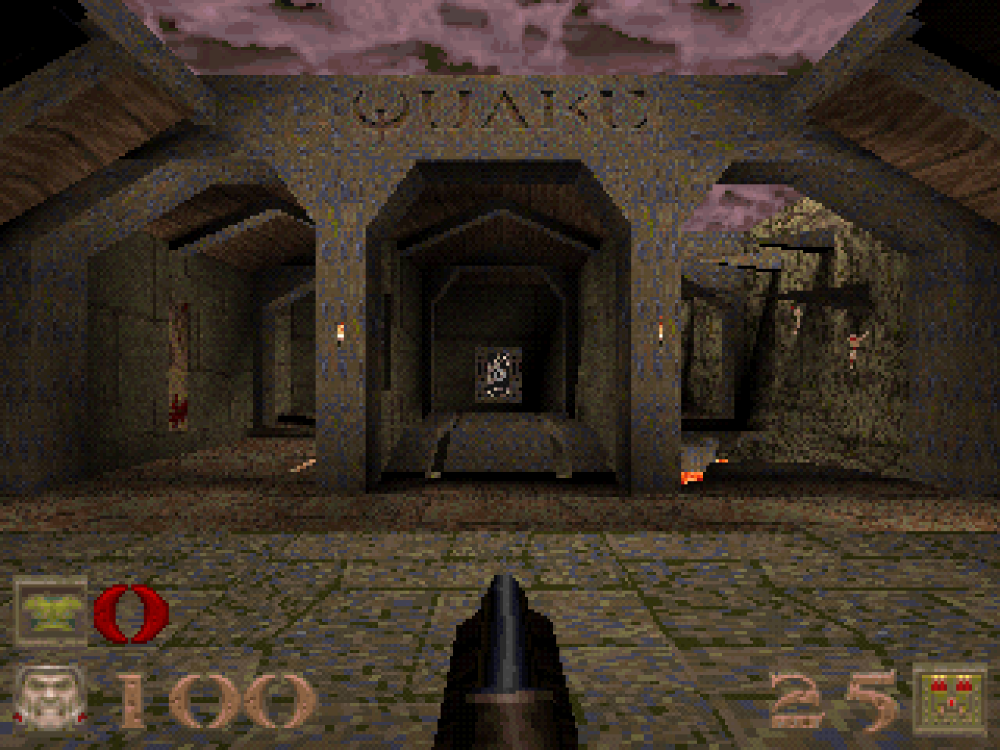
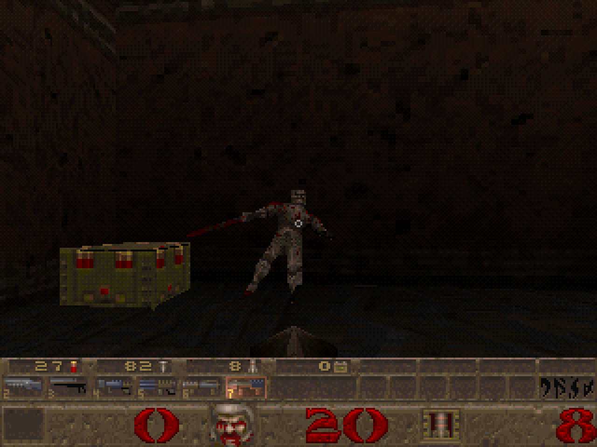
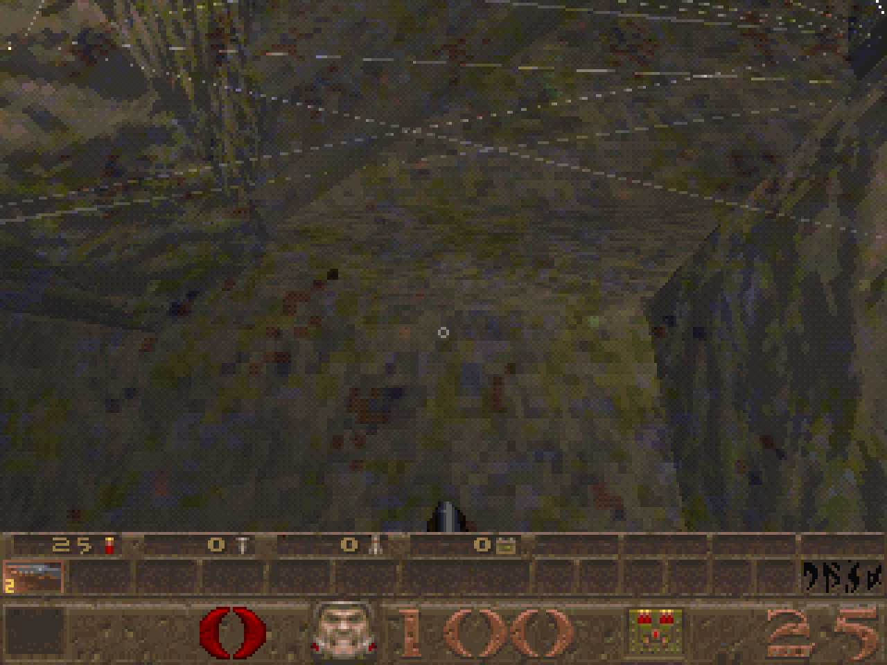
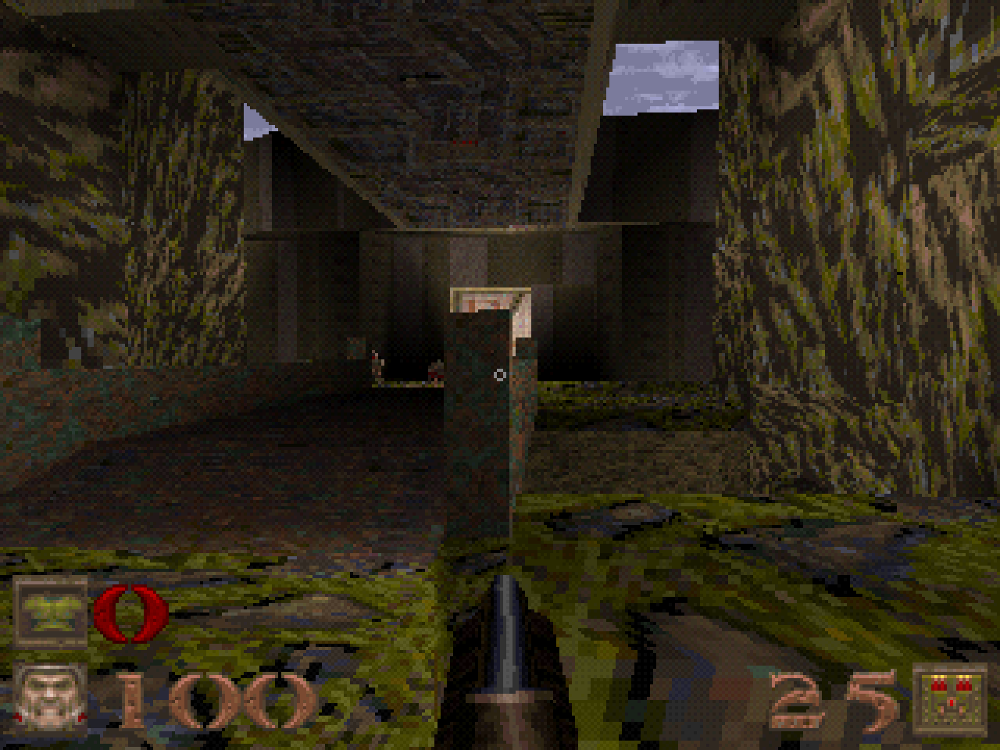

# quake-psx

Start with the [PSoXide Demo Disc](https://bonnie-studios.itch.io/psoxide-demo-disc): it includes Quake-PSX
and the other Bonnie Studios PlayStation demos. Standalone downloads are available
for testing just this project.

A Rust port of Quake's shareware episode for the original PlayStation, built
with the [PSoXide](https://github.com/EBonura/PSoXide) SDK.

The port includes Start and E1M1 through E1M8, the shareware weapons and
monsters, BSP collision, moving brushes, triggers, audio, menus, two HUD modes,
layered sky and turbulent water. It has been tested extensively on original
PlayStation hardware and in emulators. Performance work and compatibility
improvements are ongoing.

## Lineage

This is not the first homebrew Quake project for the PlayStation. id
Software's GPL Quake source and the earlier C-based QuakePSX port by fgsfdsfgs
and its contributors were used as the original source and PlayStation
reference. A limited amount of GPL code and behaviour was adapted from that
work, and it remains credited and licensed here.

The current release is not a repackaging of the earlier C port. Its shipping
runtime is Rust-only and built on the PSoXide SDK. The asset cooker, runtime
formats, renderer integration, menus and HUDs, Episode 1 gameplay coverage,
monster and weapon systems, moving-world behaviour, audio integration,
regression tools and release pipeline were implemented or substantially
completed for this project. See [PROVENANCE.md](PROVENANCE.md) for the exact
boundary.

Quake data and generated disc images are not stored in this repository. The
builder obtains Quake 1.06 shareware data, checks its digest and converts it
locally.

| Minimal HUD (default) | Classic HUD |
| --- | --- |
| [](docs/readme/minimal-hud.png) | [](docs/readme/classic-hud.png) |

| Translucent water | Sprite rendering |
| --- | --- |
| [](docs/readme/clear-water.png) | [](docs/readme/sprite-rendering.png) |

## Status

| Area | Current state |
| --- | --- |
| Maps | Start and E1M1-E1M8 cook and load |
| Gameplay | Single-player movement, combat, pickups, hazards and level changes |
| Weapons | Axe, shotguns, nailguns, grenade launcher, rocket launcher and lightning |
| Monsters | Soldier, Dog, Ogre, Zombie, Knight, Wizard, Shambler, Demon and Chthon |
| World | Doors, lifts, buttons, trains, teleporters, secrets and scripted targets |
| Presentation | Minimal and Classic HUDs, menus, sprites, sky, water, screen blends and positional audio |
| Target | Original PlayStation at 320x240 |
| Performance | 30 fps goal; route measurements and their SDK revisions are recorded in [RENDERING.md](RENDERING.md) |
| Hardware | Extensively tested on original PlayStation hardware and in emulators |

See [COVERAGE.md](COVERAGE.md) for the gameplay checklist and
[VALIDATION.md](VALIDATION.md) for the test commands and current limits.

## Build

### Requirements

- Rust installed with [rustup](https://rustup.rs/)
- Host C/C++ build tools/linker for the Rust host executables
- `curl`, `unzip`, and `7z` or `7zz` for the shareware archive
- Git and an authenticated GitHub CLI (`gh auth login`); release builds verify
  that the pinned PSoXide revision is reachable from its `main` branch
- Python 3 and `mipsel-none-elf-objdump` for guest validation tools

Bootstrap the pinned SDK before compiling the builder. No sibling PSoXide
checkout is required:

```sh
git clone https://github.com/EBonura/quake-psx.git
cd quake-psx
cargo run --locked --manifest-path psoxide-pin/Cargo.toml
cargo run --locked --release --manifest-path host/quake-build/Cargo.toml -- build
```

`components.lock.json` pins the SDK, emulator support crates, and editor/engine
sources independently. The SDK is `a156a2f5`, the emulator is `020163fe`, and
the editor is `6188e908`; the lock records their full immutable revisions.
The bootstrap verifies imported file hashes before reuse. No external firmware
is loaded by PSoXide.

For a local override, use a clean, bootstrapped PSoXide-editor checkout at the
locked editor revision:

```sh
cargo run --locked --release --manifest-path host/quake-build/Cargo.toml -- build --psoxide /path/to/PSoXide-editor
```

Set `QUAKE_PSX_FRONTEND` to the standalone PSoXide-emulator frontend executable
for regression commands. The shipping provenance records all three components.

The output is written to `dist/`:

```text
quake-psx.bin
quake-psx.cue
quake-psx.exe
quake-psx.provenance.json
```

Open `quake-psx.cue` in PSoXide, DuckStation or another compatible PlayStation
emulator. On original hardware, burn the BIN/CUE pair with software that
understands CUE sheets.

To build from an existing Quake installation, pass its directory explicitly:

```sh
cargo run --locked --release --manifest-path host/quake-build/Cargo.toml -- build \
  --psoxide /path/to/PSoXide-editor \
  --quake-dir /path/to/Quake/id1
```

The builder still requires the known Quake 1.06 shareware `PAK0.PAK` digest.

## Useful commands

The repository root is the PS1 game's Cargo workspace, so every crate the
image links is hashed by a path relative to it and the image doesn't depend on
where the repository is checked out. The builder is a separate workspace in
`host/quake-build/`; from the repository root, `cargo quake-build` (an alias
in `.cargo/config.toml`) is short for
`cargo run --release --manifest-path host/quake-build/Cargo.toml --`.

```sh
cargo quake-build check       # check tools, source data and SDK revision
cargo quake-build assets      # recook Episode 1 assets
cargo quake-build compile     # rebuild the PS1 executable
cargo quake-build disc        # rebuild the standalone disc
cargo quake-build --help      # list regression commands
```

Pass `--psoxide /path/to/PSoXide-editor` when using the explicit SDK worktree.

## Controls

| Input | Action |
| --- | --- |
| Left stick or D-pad | Move |
| Right stick | Look |
| R2 | Fire |
| Cross | Jump |
| Square | Use |
| L1 / R1 | Previous or next weapon |
| Triangle + D-pad | Select a weapon directly |
| Start or Select | Pause |

DualShock controllers are placed in analog mode at boot and after reconnecting.
Digital controllers continue to use the D-pad. The Options menu includes
deadzone, brightness, HUD, water-warp and translucent-water settings.

## Project layout

| Path | Purpose |
| --- | --- |
| `game/` | PlayStation executable and platform integration |
| `crates/quake-core/` | Gameplay, movement, collision and host-side tests |
| `crates/quake-formats/` | Checked runtime and disc formats |
| `crates/quake-cook/` | Quake asset conversion |
| `host/quake-build/` | Host build tool, disc packager and emulator test runner |
| `tools/routesim/` | Host route and collision inspection tool |
| `tools/cfg/` | Quake resource maps used by the cooker |
| `id1psx/` | Ignored generated game data |
| `dist/` | Ignored standalone build output |

The code in `game/` runs on the PlayStation. The program in
`host/quake-build/` runs on the development computer and coordinates the
build; it is not a second game runtime.

## Validation

Run the host suites from their individual workspaces:

```sh
cargo test --manifest-path host/quake-build/Cargo.toml
(cd crates/quake-cook && cargo test)
(cd crates/quake-core && cargo test)
(cd crates/quake-formats && cargo test)
cargo quake-build check --psoxide /path/to/PSoXide-editor
```

The emulator regressions cover map loading, combat, monsters, mechanisms,
routes, audio, memory and a fixed visual camera. They are documented in
[VALIDATION.md](VALIDATION.md). Emulator results do not replace testing on a
real console.

Rendering design and image checks are described in
[RENDERING.md](RENDERING.md) and [VISUAL_PARITY.md](VISUAL_PARITY.md).

## Optional CD audio

The shareware archive does not include the original soundtrack. Lawfully
obtained, sector-aligned 44.1 kHz stereo PCM tracks can be placed at
`id1psx/music/track02.cdda` through `track11.cdda` and enabled with
`--with-cdda`. Audio files are intentionally excluded from Git.

## Data and licensing

The source is released under GPL-2.0-only. Quake maps, models, textures,
sounds and other game data remain copyrighted by their respective owners and
are not included.

Read [PROVENANCE.md](PROVENANCE.md) and
[THIRD_PARTY_NOTICES.md](THIRD_PARTY_NOTICES.md) before redistributing the
source or build instructions.

Quake is a trademark of ZeniMax Media Inc. PlayStation is a trademark or
registered trademark of Sony Interactive Entertainment Inc. This is an
unofficial project and is not affiliated with or endorsed by id Software,
Bethesda, ZeniMax or Sony.

## Recent changes

Source snapshot **2026.09.05.1**: Removed unselected renderer experiments and their obsolete benchmark commands.
See the [changelog](CHANGELOG.md) for the remaining changes and published download versions.
